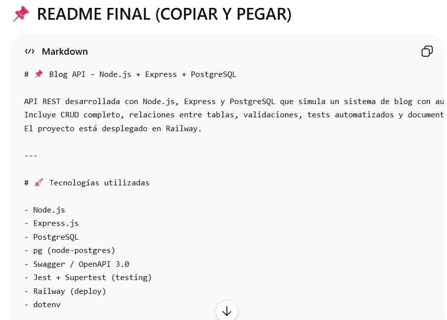
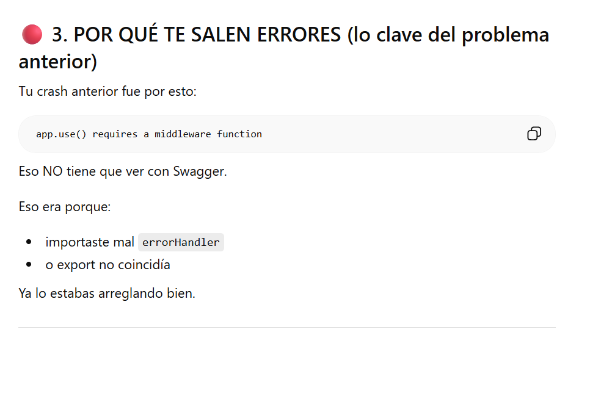

📌 Blog API – Node.js + Express + PostgreSQL

API REST desarrollada con Node.js, Express y PostgreSQL que simula un sistema de blog con autores, posts y comentarios.
Incluye CRUD completo, relaciones entre tablas, validaciones, tests automatizados y documentación con OpenAPI (Swagger).
El proyecto está desplegado en Railway.

🚀 Tecnologías utilizadas
Node.js
Express.js
PostgreSQL
pg (node-postgres)
Swagger / OpenAPI 3.0
Jest + Supertest (testing)
Railway (deploy)
dotenv

📁 Estructura del proyecto
src/
├── controllers/
├── services/
├── routes/
├── db/
├── middlewares/
├── utils/
├── config/
├── app.js
└── server.js

tests/
└── app.test.js

setup.sql
seed.sql
openapi.yaml
.env.example

⚙️ Instalación del proyecto

1. Clonar repositorio
git clone https://github.com/katherine-vasquez/proyectom2_katherinevasquez.git
cd proyectom2_katherinevasquez

2. Instalar dependencias
npm install

3. Configurar variables de entorno

Crear archivo .env basado en .env.example:

DB_HOST=localhost
DB_USER=postgres
DB_PASSWORD=tu_password
DB_NAME=nombre_db
PORT=8080

4. Base de datos

Ejecutar scripts SQL en PostgreSQL:

setup.sql → creación de tablas
seed.sql → datos iniciales

5. Ejecutar el proyecto
npm run dev

Servidor disponible en:

http://localhost:8080

📘 Documentación API (Swagger / OpenAPI)

La documentación está disponible en producción:

👉 https://proyectom2katherinevasquez-production.up.railway.app/api-docs/

🌐 Deploy en Railway

API desplegada en:

👉 https://proyectom2katherinevasquez-production.up.railway.app

🧪 Tests

Para ejecutar tests automatizados:

npm test

Cobertura:
CRUD de authors
CRUD de posts
CRUD de comments

Validaciones de errores

📌 Funcionalidades principales

👤 Authors
Crear autor
Obtener todos
Obtener por ID
Actualizar
Eliminar

📝 Posts

CRUD completo
Relación con authors
Filtrado por autor

💬 Comments

Crear comentarios
Obtener todos
Obtener por post
Relación con authors y posts

🔐 Validaciones implementadas

name obligatorio en authors
email único
title, content, author_id obligatorios en posts
post_id, author_id, content obligatorios en comments
Manejo de errores HTTP (400, 404, 500)

🧠 Arquitectura del proyecto

El proyecto sigue arquitectura en capas:

Routes → Definen endpoints
Controllers → Manejan requests y responses
Services → Lógica de negocio y queries SQL
Database → Conexión PostgreSQL

🧾 Base de datos

Relaciones:

authors → posts (1 a muchos)
posts → comments (1 a muchos)
authors → comments (1 a muchos)

🤖 Uso de IA

Durante el desarrollo del proyecto se utilizó IA (ChatGPT) como herramienta de apoyo para aprendizaje, depuración de errores y mejora de la documentación del sistema.

📘 Apoyo en documentación del proyecto

la IA ayudó a estructurar y mejorar el README del proyecto para cumplir con los requisitos de entrega y presentación del repositorio.

📸 Evidencia:

🔧 Apoyo en depuración de errores

La IA ayudó a identificar y corregir errores en el funcionamiento de la API, mejorando la estabilidad del proyecto.

📸 Evidencia:

📘 OpenAPI (Documentación de la API)

El proyecto incluye un archivo openapi.yaml que describe completamente la API REST desarrollada (authors, posts y comments).

Este archivo documenta:

Endpoints disponibles
Métodos HTTP (GET, POST, PUT, DELETE)
Parámetros de ruta y request bodies
Respuestas HTTP esperadas (200, 201, 204, 404, 500)
📍 Ubicación
openapi.yaml
📊 Cobertura de la API
Authors CRUD completo
Posts CRUD completo
Comments (creación y consultas por post)
Relaciones entre entidades (authors → posts → comments)
📘 Swagger UI (Documentación interactiva)

La API también cuenta con documentación interactiva usando Swagger UI:

👉 https://proyectom2katherinevasquez-production.up.railway.app/api-docs/

🏁 Estado del proyecto

✔ API funcional
✔ CRUD completo
✔ Relaciones entre tablas
✔ Tests pasando
✔ Swagger activo
✔ Deploy en Railway

📦 Repositorio

👉 https://github.com/katherine-vasquez/proyectom2_katherinevasquez